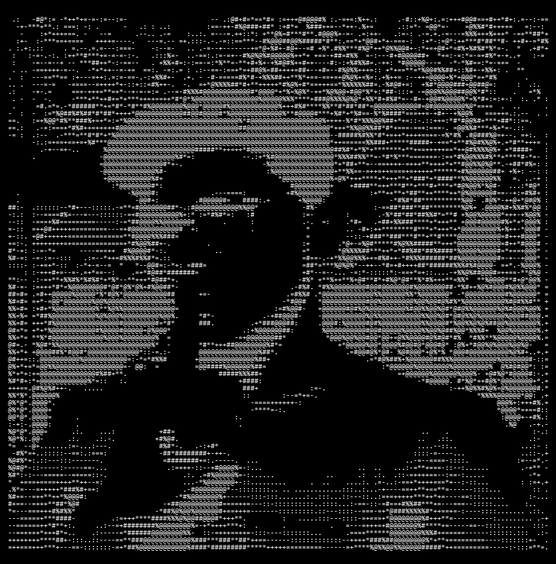

<!-- ═══════════════════════ ASCII ART HEADER ═══════════════════════ -->

<!-- ═══════════════════════ HEADER ANIMATION ═══════════════════════ -->

 

<!-- ═══════════════════════ BADGES ═══════════════════════ -->

  
  &nbsp;
  
  &nbsp;
  
  &nbsp;
  

---

<!-- ═══════════════════════ ABOUT ME ═══════════════════════ -->

## Wanna know, Who I am ?

AI & Machine Learning Engineer specializing in LLM systems, autonomous agent architectures, and high-performance ML infrastructure.

- **Pathixo Pvt. Ltd** — Co-Founder & Chief AIML Engineer, leading end-to-end AI product development and deep-tech ML solutions.
- **KrocPDF** — Building high-performance document intelligence, structured parsing, and OCR processing systems.
- **Research & Focus** — Agentic ecosystems, hardware inference acceleration, custom model orchestration, and novel AI architectures.
- **Background** — Data Science & LLM optimization at Outlier AI / Scale AI; Computer Science with AI/ML specialization.

Driven by transforming frontier AI research into scalable developer tools and production-grade intelligent systems.

---

<!-- ═══════════════════════ FEATURED PROJECTS ═══════════════════════ -->

## Best of My Work

| Project | Focus | Description | Links |
|:---|:---|:---|:---:|
| **KrocPDF** | `Document AI` `OCR Engine` | High-performance document processing and intelligence engine for complex PDF pipelines. | [Repository](https://github.com/jhaabhijeet864) |
| **Hardware Inference Engine for GPU** | `GPU Compute` `LLM Systems` | Full-stack memory & compute requirement calculator and inference architect for LLMs across modern GPU architectures. | [Repository](https://github.com/jhaabhijeet864/Hardware_Infernece_Engine_For_GPU) |
| **Self-Improving Agentic System** | `Autonomous Agents` `Orchestration` | Recursive, self-optimizing agentic execution framework designed for multi-step reasoning and automated tooling. | [Repository](https://github.com/jhaabhijeet864/Self_Improving_Agentic_System) |
| **My Kanha Project** | `Conversational AI` `Mobile` | Interactive spiritual intelligence assistant and conversational avatar bringing Gita wisdom to mobile applications. | [Repository](https://github.com/jhaabhijeet864/My_Kanha_Project) |
| **Wake Bot** | `Automation` `Systems` | Multithreaded autonomous environment orchestrator and desktop companion for automated startup workflows. | [Repository](https://github.com/jhaabhijeet864/wake_bot) |

---

<!-- ═══════════════════════ STATS & CONTRIBUTIONS ═══════════════════════ -->

## GitHub Stats & Activity

  
  &nbsp;&nbsp;&nbsp;
  

  

 

<!-- ═══════════════════════ SNAKE GAME ═══════════════════════ -->

## My Pet Snake

  <picture>
    <source media="(prefers-color-scheme: dark)" srcset="https://raw.githubusercontent.com/jhaabhijeet864/jhaabhijeet864/output/github-contribution-grid-snake-dark.svg?v=1" />
    <source media="(prefers-color-scheme: light)" srcset="https://raw.githubusercontent.com/jhaabhijeet864/jhaabhijeet864/output/github-contribution-grid-snake.svg?v=1" />
    
  </picture>

---

<!-- ═══════════════════════ ORGANIZATIONS & ECOSYSTEM ═══════════════════════ -->

## Organizations & Ecosystems

  
  &nbsp;
  
  &nbsp;
  
  &nbsp;
  
  &nbsp;
  
  &nbsp;
  

 

<!-- ═══════════════════════ FOOTER ═══════════════════════ -->

  
  &nbsp;
  
  &nbsp;
  

